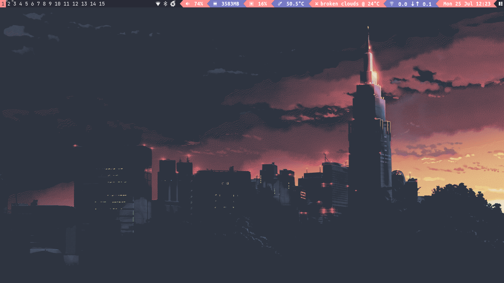
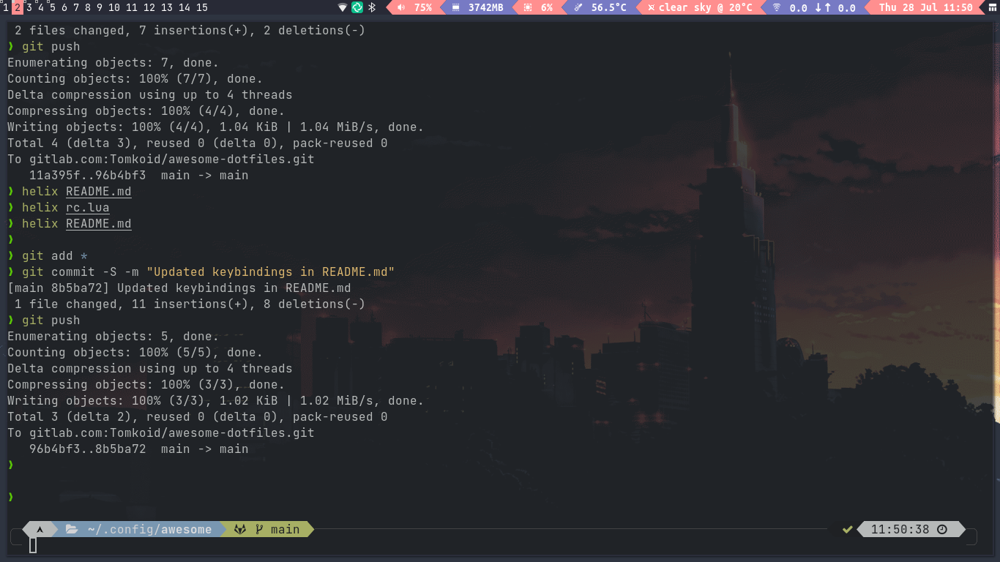

### My dotfiles for Awesome WM inspired by [DT's Awesome Dotfiles](https://gitlab.com/dtos/etc/dtos-awesome)

| Keybinding            | Description               |
|-----------------------|---------------------------|
| Super + Enter         | Open a terminal           |
| Super + Shift + Enter | Open rofi (run launcher)  |
| Super + Shift + c     | Close focused window      |
| Super + Ctrl + n      | Restore minimized windows |
| Super + b             | Launch browser            |
| Super + Shift + k     | Open keepassxc            |
| Super + l             | Lock screen               |
| Super + s             | Show help                 |
| Super + t             | Toggle floating mode      | 
| Super + m             | Maximize window           |
| Super + n             | Minimize window           |
| Super + Right Arrow   | Switch to next tag        |
| Super + Left Arrow    | Switch to previous tag    |
| Super + Tab           | Switch to next layout     |
| Super + Shift + Tab   | Switch to previous layout |
| Ctrl  + Super + r     | Rename tag                |
| Shift + Super + d     | Delete tag                |
| Shift + Super + n     | Create new tag            |
| Alt + Shift + x       | Execute lua code          |

More keybindings are available in help (Super + s)

### Screenshots:

